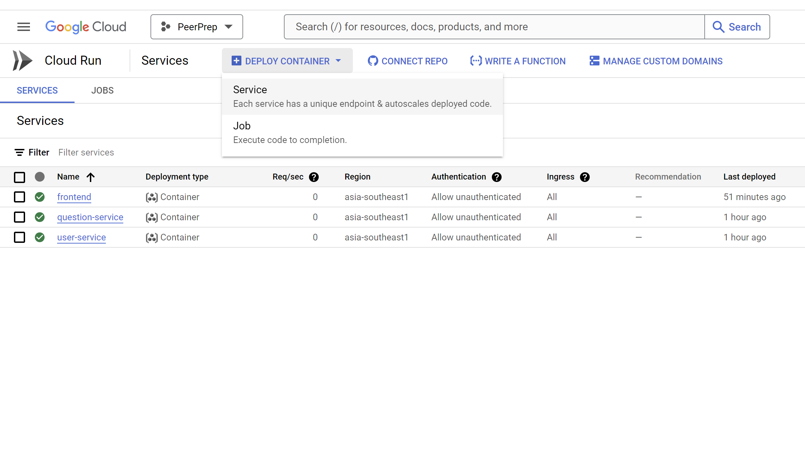

[](https://classroom.github.com/a/bzPrOe11)
# CS3219 Project (PeerPrep) - AY2425S1
## Group: G02
### 3 ways to access the application: 
1. Public hosted website *(public containerization)*
2. Docker compose up locally *(local containerization)*
3. Individual services wind up *(local development)*


### Public hosted website:
You can access the PeerPrep application at https://frontend-1079323726684.asia-southeast1.run.app

How to deploy website to public:

1. Build each service (with environment variable provided if needed) and push to gcr. *If this is your first time docker pushing to gcr, you would need to link your Google account with docker first, and then select the PeerPrep project. Do that before proceeding* 
  ```sh
  cd backend/user_service
  docker build -t user_service .
  docker tag user_service gcr.io/peerprep-g02/user_service
  docker push gcr.io/peerprep-g02/user_service

  cd ../question_service 
  docker build --build-arg USER_SERVICE_BACKEND_URL=https://user-service-1079323726684.asia-southeast1.run.app/verify-token -t question_service .
  docker tag question_service gcr.io/peerprep-g02/question_service
  docker push gcr.io/peerprep-g02/question_service

  cd ../../frontend
  docker build --build-arg VITE_QUESTION_SERVICE_BACKEND_URL=https://question-service-1079323726684.asia-southeast1.run.app -t frontend .
  docker tag frontend gcr.io/peerprep-g02/frontend
  docker push gcr.io/peerprep-g02/frontend
  ```
  Go to Google Cloud container/artifact registry to see your pushed images at gcr. Google Cloud container/artifact registry can be found by going to Cloud Console and then typing container registry:
  

  You should be able to see your just pushed images in gcr:


2. Go to Cloud Run and for each services, deploy container via service


3. Fill in the details accordingly. For our frontend service example, container image URL should be `gcr.io/peerprep-g02/frontend`. Service name could be anything, like `frontend`. Region choose the region closest to you. Scroll down and remember to configure the container port number to suit the exposed container port as defined by the `Dockerfile` as well.


Repeat this until all services are hosted

### Docker compose up locally:
```
cd project-root/
docker compose build
docker compose up -d
```


Access the frontend at `localhost:3000`, the user service (backend) at `localhost:5001` and the question service (backend) at `localhost:5002`.

### Individual services wind up:
For each backend service, cd into them and run `node server.js` or `nodemon server.js` \
For the frontend service, cd into it and run `npm run dev`
